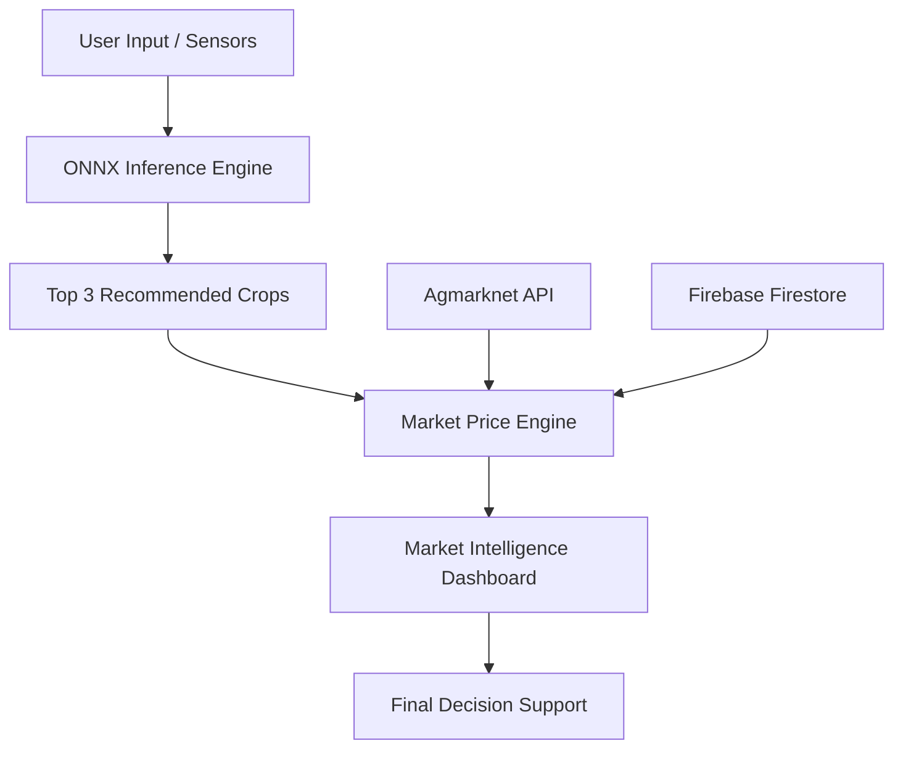

# KisanBandhu: AI-Powered Crop Advisor & Market Intelligence

[](https://kotlinlang.org/)
[](https://developer.android.com/)
[](https://onnxruntime.ai/)
[](https://firebase.google.com/)

**KisanBandhu** is a comprehensive decision-support mobile application designed to empower farmers with data-driven insights. By combining on-device Machine Learning with real-time market price analysis, the app helps farmers decide **what to grow** and **when to sell** to maximize profitability.

---

## 🌟 Key Features

### 1. Smart AI Crop Recommendation
- **On-Device Inference**: Uses an ONNX-optimized Scikit-Learn model to predict the most suitable crops based on soil NPK levels, pH, and local weather.
- **Top 3 Suitability**: Provides multiple recommendations with confidence percentages.
- **Offline Capable**: Runs predictions without requiring an active internet connection.

### 2. Market Intelligence Dashboard
- **Live Mandi Prices**: Fetches real-time prices from the Agmarknet API (data.gov.in).
- **Categorized Browsing**: Automatically sorts crops into Vegetables, Fruits, and Grains.
- **Dynamic Price Tags**: Instant visual indicators for "Good Price," "Average," and "Low Price" based on market trends.
- **Market Statistics**: Real-time counts of rising prices, falling prices, and "Best Deals" in the region.

### 3. Advanced Search & Alerts
- **Voice Search**: Accessibility-focused search allowing farmers to speak crop names.
- **Price-Based Search**: Intelligent filtering that understands numeric queries.
- **Price Alerts**: Set target prices for specific crops and receive notifications when the market reaches that target.

---

## 📸 Screenshots

|                               Login & OTP                               | Home Dashboard | AI Recommendation | Market Analysis |
|:-----------------------------------------------------------------------:| :---: | :---: | :---: |
|  |  |  |  |

---

## ⚙️ Technology Stack

- **Language**: Kotlin
- **Architecture**: MVVM (Model-View-ViewModel)
- **AI Engine**: ONNX Runtime for Android
- **Networking**: Retrofit 2 & OkHttp
- **Database/Backend**: Firebase Firestore (History), Firebase Auth (Phone)
- **Image Loading**: Coil
- **Location Services**: Fused Location Provider & Geocoder API

---

## 🛠 Data Pipeline & Logic

### AI Inference Pipeline
1. **Input**: User enters Nitrogen (N), Phosphorus (P), Potassium (K), and pH.
2. **Environmental Fetch**: App automatically fetches live Temperature, Humidity, and Rainfall via Weather API.
3. **Tensor Processing**: Data is wrapped into a FloatBuffer and passed to the ONNX session.
4. **Output**: The model returns a probability array; the app extracts and localizes the Top 3 crop names.

### 4-Layer Market Fallback Strategy
To ensure the app remains functional even when government servers are slow or data is scarce:
- **Layer 1 (Regional)**: Fetches mandi prices for the user's specific State.
- **Layer 2 (National)**: If state data is insufficient (<15 records), it fetches top national records.
- **Layer 3 (Persistent Cache)**: If offline, it displays the last successfully fetched prices from SharedPreferences.
- **Layer 4 (Static Benchmark)**: Built-in dataset for common crops used as a final safety net.

---

## 📐 Architecture Diagram



---

## ⚡ Performance Optimization (Low Latency)

- **Asynchronous Execution**: All network and AI tasks run on `Dispatchers.IO` using Kotlin Coroutines.
- **Search Debouncing**: Implemented a 600ms typing delay to prevent API flooding and keep the UI responsive.
- **On-Device Brain**: Moving the ML model to the device eliminated server latency, providing instant 100ms predictions.

---

## 🚀 Getting Started

### Prerequisites
- Android Studio Hedgehog or newer.
- A valid `google-services.json` from your Firebase Console.
- API Key from [data.gov.in](https://data.gov.in/).

### Installation
1. Clone the repository:
   ```bash
   git clone https://github.com/yourusername/KisanBandhu.git
   ```
2. Place your `google-services.json` in the `/app` directory.
3. Open the project in Android Studio.
4. Sync Gradle and Run the application.

---

## 🧪 Development & Testing
For rapid development, we implemented a **Mock Auth Bypass**:
- Use the test number `9876543210` to skip Firebase SMS verification and jump directly to UI testing.

---

## 📝 License
Distributed under the MIT License. See `LICENSE` for more information.

---

**Developed with ❤️ for the farming community.**
