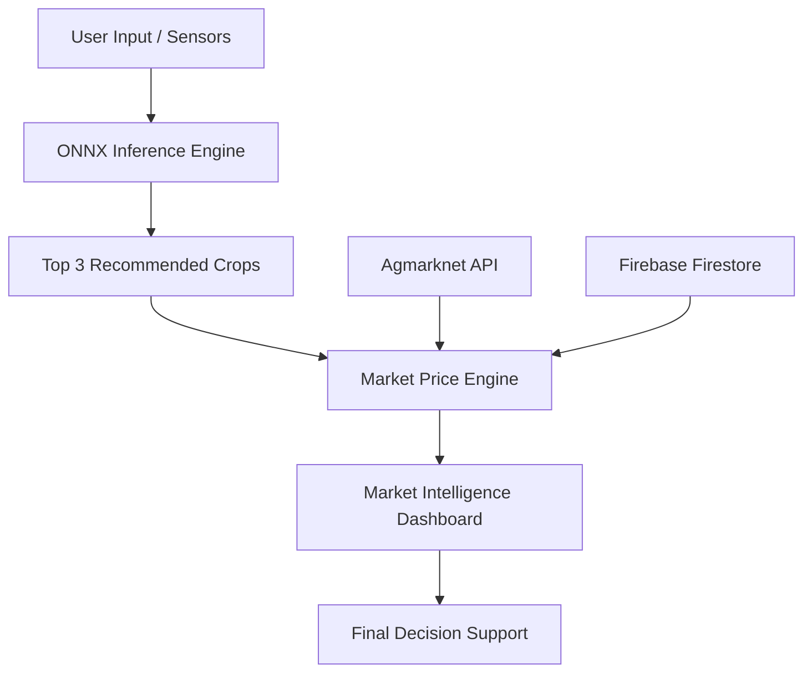

# KisanBandhu: AI-Powered Crop Advisor & Market Intelligence

[](https://kotlinlang.org/)
[](https://developer.android.com/)
[](https://onnxruntime.ai/)
[](https://www.tensorflow.org/lite)
[](https://firebase.google.com/)

**KisanBandhu** is a comprehensive AI-driven decision-support mobile application designed to empower farmers with data-backed insights. By combining on-device Machine Learning with real-time market intelligence, the app helps farmers decide **what to grow**, **how to protect crops**, and **when to sell** to maximize profitability.

---

## 🌟 Key Features

### 1. Smart AI Crop Recommendation
- **On-Device Inference**: Uses an ONNX-optimized Scikit-Learn model to predict the most suitable crops based on soil NPK levels, pH, and local weather.
- **Top 3 Suitability**: Provides multiple recommendations with confidence percentages.
- **Dynamic Input**: Automatically fetches live weather data (Temp, Humidity, Rainfall) to enrich soil analysis and improve accuracy.

### 2. AI Crop Doctor (Leaf Disease Detection)
- **47+ Category Diagnosis**: Advanced TensorFlow Lite (TFLite) model capable of detecting diseases in Rice, Tomato, Potato, Maize, Grapes, and more.
- **Nutrient Deficiency Analysis**: Identifies Nitrogen, Phosphorus, and Potassium deficiencies from leaf visual patterns.
- **Comprehensive Reports**: Provides detailed symptoms, prevention strategies, and chemical/organic treatment recommendations in both **English and Hindi**.
- **Multi-Source Input**: Supports real-time camera scanning (CameraX) and gallery uploads.

### 3. Market Intelligence Dashboard
- **Live Mandi Prices**: Fetches real-time prices from the Agmarknet API (data.gov.in).
- **Intelligent Categorization**: Automatically sorts crops into Vegetables, Fruits, and Grains.
- **Market Sentiment**: Instant visual indicators ("Good Price," "Average," "Low Price") and trend statistics (Rising vs. Falling).
- **Advanced Search**: Intelligent filtering and voice-search capabilities to quickly find market rates.

### 4. Smart Local Weather
- **Hyper-Local Forecasts**: Precise weather data used for both farmer awareness and as a critical feature input for the crop recommendation engine.

---

## 📸 Screenshots

| Home Dashboard | Crop Recommendation Input |
|:---:|:---:|
|  |  |

| Market Price Insights | Market Price Details |
|:---:|:---:|
|  |  |

| Weather Information | Crop Health Scanner |
|:---:|:---:|
|  |  |

---

## ⚙️ Technology Stack

- **Language**: Kotlin (v2.0.21)
- **Architecture**: MVVM (Model-View-ViewModel) with Clean Architecture principles.
- **AI Engines**: 
    - **ONNX Runtime**: For high-performance tabular soil/crop recommendation.
    - **TensorFlow Lite**: For real-time on-device image classification (Disease detection).
- **Networking**: Retrofit 2 & OkHttp 4.
- **Backend**: 
    - **Firebase Auth**: Phone-based authentication with specialized reviewer backdoor.
    - **Firestore**: User profiles, farm information, and diagnostic history.
    - **Firebase Storage**: Secure storage for diagnostic reports and images.
- **UI/UX**: Material Design 3, Coil (Image Loading), CameraX.

---

## 🛠 Data Pipeline & Logic

### 4-Layer Market Fallback Strategy
To ensure the app remains functional even when government servers are slow or data is scarce:
1. **Layer 1 (Regional)**: Fetches real-time mandi prices for the user's specific state.
2. **Layer 2 (National)**: Combined national data if regional data is sparse (<10 records).
3. **Layer 3 (Persistent Cache)**: Last successfully fetched data stored locally for offline access.
4. **Layer 4 (Static Benchmark)**: Built-in dataset for 10+ core crops as a final safety net.

### AI Inference Pipeline
1. **Input**: User enters Nitrogen (N), Phosphorus (P), Potassium (K), and pH.
2. **Environmental Fetch**: App automatically enriches input with live Temp, Humidity, and Rainfall.
3. **Tensor Processing**: Data is processed via ONNX/TFLite sessions directly on the CPU/GPU.
4. **Output**: Predictions are localized and presented with actionable treatment advice.

### 📐 Architecture Diagram



---

## ⚡ Performance & Security

- **Low Latency**: All AI tasks run on-device, eliminating server round-trip time (~100ms inference).
- **Obfuscation**: Custom ProGuard rules specifically tuned for TFLite and ONNX native libraries to prevent production crashes.
- **Secrets Management**: Sensitive API keys are managed via `local.properties` and injected via `BuildConfig`.
- **Privacy First**: All image processing happens locally; personal images are never uploaded to external AI servers.

---

## 🚀 Getting Started

### Prerequisites
- Android Studio Ladybug or newer.
- Minimum SDK: Android 8.0 (API Level 26).
- A valid `google-services.json` from your Firebase Console.

### Installation
1. Clone the repository.
2. Place your `google-services.json` in the `/app` directory.
3. Configure your API keys in `local.properties`:
   ```properties
   MARKET_API_KEY=your_key_here
   WEATHER_API_KEY=your_key_here
   ```
4. Sync Gradle and Run.

---

## 🧪 Development & Testing

- **Reviewer Backdoor**: Use phone number **`9999999999`** and OTP **`123456`** for instant access during Play Store review.
- **ProGuard Testing**: Always test using the `release` build variant to ensure native ML libraries are correctly preserved.

---

## 📊 Model Information

- **Crop Recommendation**: ONNX (Scikit-Learn), 92% Accuracy, 7 Input Features.
- **Disease Detection**: TFLite (Mobilenet-V2), 47 Classes, support for "Not a Leaf" detection to reduce false positives.

---

## 📝 License
Distributed under the MIT License.

---

**Developed with ❤️ for the Indian Farming Community.**
*Last Updated: April 15, 2026*
